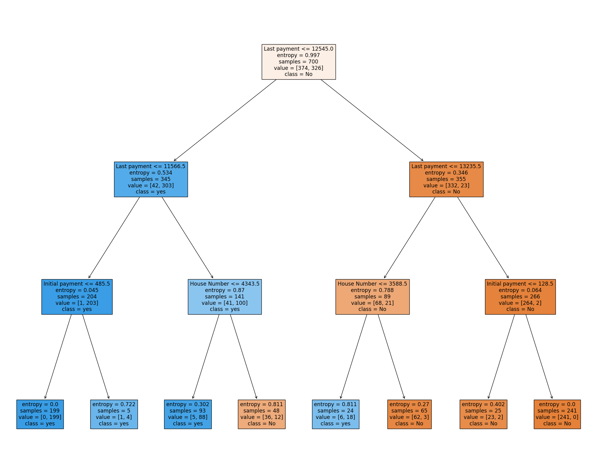

# Decision Tree 

This GitHub repository contains a comprehensive Decision Tree implementation for data analysis and predictive modeling. Decision Trees are powerful tools for classification and regression tasks, as they provide interpretable and intuitive insights into data patterns.

## Features

- **Flexible**: Supports both classification and regression tasks.
- **Pruning**: Implements pruning techniques to prevent overfitting.
- **Customizable**: Easily configure tree depth, splitting criteria, and more.
- **Visualization**: Visualize the generated tree structure.
- **Scalable**: Handles both small and large datasets efficiently.

## Getting Started

### Installation

To use the Decision Tree module, simply clone this repository or download the code:

```bash
git clone https://github.com/yourusername/decision-tree.git
```

### Usage

1. Import the `DecisionTree` class:

```python
from decision_tree import DecisionTree
```

2. Create a Decision Tree object:

```python
dt = DecisionTree()
```

3. Fit the model to your data:

```python
dt.fit(X_train, y_train)
```

4. Make predictions:

```python
predictions = dt.predict(X_test)
```

### Customization

You can customize the Decision Tree behavior by specifying parameters like `max_depth`, `min_samples_split`, and the splitting criterion.

```python
dt = DecisionTree(max_depth=5, min_samples_split=2, criterion='gini')
```

### Visualization

To visualize the generated tree structure, use the `plot_tree` method:

```python
dt.plot_tree()
```

### Example 

## Loan Repayement Prediction 

```python
#import library 
import numpy as np
import pandas as pd
import matplotlib.pyplot as plt
from sklearn.model_selection import train_test_split
from sklearn.metrics import accuracy_score
from sklearn import tree

#Load dataset
df = pd.read_csv('Loan_Dataset.csv',sep= ',', header= 0)
df.head(10)
```


<div>
<style scoped>
    .dataframe tbody tr th:only-of-type {
        vertical-align: middle;
    }

    .dataframe tbody tr th {
        vertical-align: top;
    }

    .dataframe thead th {
        text-align: right;
    }
</style>
<table border="1" class="dataframe">
  <thead>
    <tr style="text-align: right;">
      <th></th>
      <th>1</th>
      <th>2</th>
      <th>3</th>
      <th>4</th>
      <th>sum</th>
      <th>Unnamed: 5</th>
    </tr>
  </thead>
  <tbody>
    <tr>
      <th>0</th>
      <td>201</td>
      <td>10018</td>
      <td>250</td>
      <td>3046</td>
      <td>13515</td>
      <td>yes</td>
    </tr>
    <tr>
      <th>1</th>
      <td>205</td>
      <td>10016</td>
      <td>395</td>
      <td>3044</td>
      <td>13660</td>
      <td>yes</td>
    </tr>
    <tr>
      <th>2</th>
      <td>257</td>
      <td>10129</td>
      <td>109</td>
      <td>3251</td>
      <td>13746</td>
      <td>yes</td>
    </tr>
    <tr>
      <th>3</th>
      <td>246</td>
      <td>10064</td>
      <td>324</td>
      <td>3137</td>
      <td>13771</td>
      <td>yes</td>
    </tr>
    <tr>
      <th>4</th>
      <td>117</td>
      <td>10115</td>
      <td>496</td>
      <td>3094</td>
      <td>13822</td>
      <td>yes</td>
    </tr>
    <tr>
      <th>5</th>
      <td>406</td>
      <td>10187</td>
      <td>166</td>
      <td>3068</td>
      <td>13827</td>
      <td>yes</td>
    </tr>
    <tr>
      <th>6</th>
      <td>461</td>
      <td>10252</td>
      <td>172</td>
      <td>3062</td>
      <td>13947</td>
      <td>yes</td>
    </tr>
    <tr>
      <th>7</th>
      <td>158</td>
      <td>10192</td>
      <td>144</td>
      <td>3469</td>
      <td>13963</td>
      <td>yes</td>
    </tr>
    <tr>
      <th>8</th>
      <td>136</td>
      <td>10376</td>
      <td>230</td>
      <td>3223</td>
      <td>13965</td>
      <td>yes</td>
    </tr>
    <tr>
      <th>9</th>
      <td>194</td>
      <td>10092</td>
      <td>626</td>
      <td>3083</td>
      <td>13995</td>
      <td>yes</td>
    </tr>
  </tbody>
</table>
</div>


```python
print("Shape of the dataset", df.shape)
```

    Shape of the dataset (1000, 6)
    


```python
#naming each columns
df.columns = ['Initial payment', 'Last payment', 'Credit Score','House Number', 'Sum', 'Result']
df
```


<div>
<style scoped>
    .dataframe tbody tr th:only-of-type {
        vertical-align: middle;
    }

    .dataframe tbody tr th {
        vertical-align: top;
    }

    .dataframe thead th {
        text-align: right;
    }
</style>
<table border="1" class="dataframe">
  <thead>
    <tr style="text-align: right;">
      <th></th>
      <th>Initial payment</th>
      <th>Last payment</th>
      <th>Credit Score</th>
      <th>House Number</th>
      <th>Sum</th>
      <th>Result</th>
    </tr>
  </thead>
  <tbody>
    <tr>
      <th>0</th>
      <td>201</td>
      <td>10018</td>
      <td>250</td>
      <td>3046</td>
      <td>13515</td>
      <td>yes</td>
    </tr>
    <tr>
      <th>1</th>
      <td>205</td>
      <td>10016</td>
      <td>395</td>
      <td>3044</td>
      <td>13660</td>
      <td>yes</td>
    </tr>
    <tr>
      <th>2</th>
      <td>257</td>
      <td>10129</td>
      <td>109</td>
      <td>3251</td>
      <td>13746</td>
      <td>yes</td>
    </tr>
    <tr>
      <th>3</th>
      <td>246</td>
      <td>10064</td>
      <td>324</td>
      <td>3137</td>
      <td>13771</td>
      <td>yes</td>
    </tr>
    <tr>
      <th>4</th>
      <td>117</td>
      <td>10115</td>
      <td>496</td>
      <td>3094</td>
      <td>13822</td>
      <td>yes</td>
    </tr>
    <tr>
      <th>...</th>
      <td>...</td>
      <td>...</td>
      <td>...</td>
      <td>...</td>
      <td>...</td>
      <td>...</td>
    </tr>
    <tr>
      <th>995</th>
      <td>413</td>
      <td>14914</td>
      <td>523</td>
      <td>4683</td>
      <td>20533</td>
      <td>No</td>
    </tr>
    <tr>
      <th>996</th>
      <td>359</td>
      <td>14423</td>
      <td>927</td>
      <td>4838</td>
      <td>20547</td>
      <td>No</td>
    </tr>
    <tr>
      <th>997</th>
      <td>316</td>
      <td>14872</td>
      <td>613</td>
      <td>4760</td>
      <td>20561</td>
      <td>No</td>
    </tr>
    <tr>
      <th>998</th>
      <td>305</td>
      <td>14926</td>
      <td>897</td>
      <td>4572</td>
      <td>20700</td>
      <td>No</td>
    </tr>
    <tr>
      <th>999</th>
      <td>168</td>
      <td>14798</td>
      <td>834</td>
      <td>4937</td>
      <td>20737</td>
      <td>No</td>
    </tr>
  </tbody>
</table>
<p>1000 rows × 6 columns</p>
</div>


```python
#Information of the dataset
print("Information of the dataset:")
df.info()
```

    Information of the dataset:
    <class 'pandas.core.frame.DataFrame'>
    RangeIndex: 1000 entries, 0 to 999
    Data columns (total 6 columns):
     #   Column           Non-Null Count  Dtype 
    ---  ------           --------------  ----- 
     0   Initial payment  1000 non-null   int64 
     1   Last payment     1000 non-null   int64 
     2   Credit Score     1000 non-null   int64 
     3   House Number     1000 non-null   int64 
     4   Sum              1000 non-null   int64 
     5   Result           1000 non-null   object
    dtypes: int64(5), object(1)
    memory usage: 47.0+ KB
    


```python
#Seperating target value
X = df.loc[:, ['Initial payment', 'Last payment', 'Credit Score', 'House Number']] 
Y = df.loc[:, ['Result']]
```


```python
#splitting dataset
X_train, X_test, y_train, y_test = train_test_split( X, Y, test_size = 0.3, random_state = 100)
```


```python
#Function to train dataset
decision_tree = DecisionTreeClassifier(criterion = "entropy", random_state = 100,max_depth=3, min_samples_leaf=5)
decision_tree.fit(X_train, y_train)
```


<style>#sk-container-id-2 {color: black;background-color: white;}#sk-container-id-2 pre{padding: 0;}#sk-container-id-2 div.sk-toggleable {background-color: white;}#sk-container-id-2 label.sk-toggleable__label {cursor: pointer;display: block;width: 100%;margin-bottom: 0;padding: 0.3em;box-sizing: border-box;text-align: center;}#sk-container-id-2 label.sk-toggleable__label-arrow:before {content: "▸";float: left;margin-right: 0.25em;color: #696969;}#sk-container-id-2 label.sk-toggleable__label-arrow:hover:before {color: black;}#sk-container-id-2 div.sk-estimator:hover label.sk-toggleable__label-arrow:before {color: black;}#sk-container-id-2 div.sk-toggleable__content {max-height: 0;max-width: 0;overflow: hidden;text-align: left;background-color: #f0f8ff;}#sk-container-id-2 div.sk-toggleable__content pre {margin: 0.2em;color: black;border-radius: 0.25em;background-color: #f0f8ff;}#sk-container-id-2 input.sk-toggleable__control:checked~div.sk-toggleable__content {max-height: 200px;max-width: 100%;overflow: auto;}#sk-container-id-2 input.sk-toggleable__control:checked~label.sk-toggleable__label-arrow:before {content: "▾";}#sk-container-id-2 div.sk-estimator input.sk-toggleable__control:checked~label.sk-toggleable__label {background-color: #d4ebff;}#sk-container-id-2 div.sk-label input.sk-toggleable__control:checked~label.sk-toggleable__label {background-color: #d4ebff;}#sk-container-id-2 input.sk-hidden--visually {border: 0;clip: rect(1px 1px 1px 1px);clip: rect(1px, 1px, 1px, 1px);height: 1px;margin: -1px;overflow: hidden;padding: 0;position: absolute;width: 1px;}#sk-container-id-2 div.sk-estimator {font-family: monospace;background-color: #f0f8ff;border: 1px dotted black;border-radius: 0.25em;box-sizing: border-box;margin-bottom: 0.5em;}#sk-container-id-2 div.sk-estimator:hover {background-color: #d4ebff;}#sk-container-id-2 div.sk-parallel-item::after {content: "";width: 100%;border-bottom: 1px solid gray;flex-grow: 1;}#sk-container-id-2 div.sk-label:hover label.sk-toggleable__label {background-color: #d4ebff;}#sk-container-id-2 div.sk-serial::before {content: "";position: absolute;border-left: 1px solid gray;box-sizing: border-box;top: 0;bottom: 0;left: 50%;z-index: 0;}#sk-container-id-2 div.sk-serial {display: flex;flex-direction: column;align-items: center;background-color: white;padding-right: 0.2em;padding-left: 0.2em;position: relative;}#sk-container-id-2 div.sk-item {position: relative;z-index: 1;}#sk-container-id-2 div.sk-parallel {display: flex;align-items: stretch;justify-content: center;background-color: white;position: relative;}#sk-container-id-2 div.sk-item::before, #sk-container-id-2 div.sk-parallel-item::before {content: "";position: absolute;border-left: 1px solid gray;box-sizing: border-box;top: 0;bottom: 0;left: 50%;z-index: -1;}#sk-container-id-2 div.sk-parallel-item {display: flex;flex-direction: column;z-index: 1;position: relative;background-color: white;}#sk-container-id-2 div.sk-parallel-item:first-child::after {align-self: flex-end;width: 50%;}#sk-container-id-2 div.sk-parallel-item:last-child::after {align-self: flex-start;width: 50%;}#sk-container-id-2 div.sk-parallel-item:only-child::after {width: 0;}#sk-container-id-2 div.sk-dashed-wrapped {border: 1px dashed gray;margin: 0 0.4em 0.5em 0.4em;box-sizing: border-box;padding-bottom: 0.4em;background-color: white;}#sk-container-id-2 div.sk-label label {font-family: monospace;font-weight: bold;display: inline-block;line-height: 1.2em;}#sk-container-id-2 div.sk-label-container {text-align: center;}#sk-container-id-2 div.sk-container {/* jupyter's `normalize.less` sets `[hidden] { display: none; }` but bootstrap.min.css set `[hidden] { display: none !important; }` so we also need the `!important` here to be able to override the default hidden behavior on the sphinx rendered scikit-learn.org. See: https://github.com/scikit-learn/scikit-learn/issues/21755 */display: inline-block !important;position: relative;}#sk-container-id-2 div.sk-text-repr-fallback {display: none;}</style><div id="sk-container-id-2" class="sk-top-container"><div class="sk-text-repr-fallback"><pre>DecisionTreeClassifier(criterion=&#x27;entropy&#x27;, max_depth=3, min_samples_leaf=5,
                       random_state=100)</pre><b>In a Jupyter environment, please rerun this cell to show the HTML representation or trust the notebook. <br />On GitHub, the HTML representation is unable to render, please try loading this page with nbviewer.org.</b></div><div class="sk-container" hidden><div class="sk-item"><div class="sk-estimator sk-toggleable"><input class="sk-toggleable__control sk-hidden--visually" id="sk-estimator-id-2" type="checkbox" checked><label for="sk-estimator-id-2" class="sk-toggleable__label sk-toggleable__label-arrow">DecisionTreeClassifier</label><div class="sk-toggleable__content"><pre>DecisionTreeClassifier(criterion=&#x27;entropy&#x27;, max_depth=3, min_samples_leaf=5,
                       random_state=100)</pre></div></div></div></div></div>


```python
#Predicting
y_pred = decision_tree.predict(X_test)
y_pred
```


    array(['yes', 'yes', 'No', 'yes', 'No', 'yes', 'yes', 'yes', 'No', 'No',
           'No', 'No', 'yes', 'No', 'No', 'yes', 'yes', 'No', 'yes', 'No',
           'No', 'yes', 'No', 'yes', 'yes', 'No', 'No', 'yes', 'No', 'No',
           'No', 'yes', 'yes', 'yes', 'yes', 'No', 'No', 'No', 'yes', 'No',
           'yes', 'yes', 'yes', 'No', 'No', 'yes', 'yes', 'yes', 'No', 'No',
           'yes', 'No', 'yes', 'yes', 'yes', 'yes', 'No', 'yes', 'No', 'yes',
           'yes', 'No', 'yes', 'yes', 'No', 'yes', 'yes', 'yes', 'No', 'No',
           'No', 'No', 'No', 'yes', 'No', 'yes', 'yes', 'No', 'yes', 'No',
           'No', 'No', 'No', 'yes', 'No', 'yes', 'No', 'yes', 'yes', 'No',
           'yes', 'yes', 'yes', 'yes', 'yes', 'No', 'yes', 'yes', 'yes',
           'yes', 'No', 'No', 'yes', 'yes', 'No', 'yes', 'yes', 'yes', 'No',
           'yes', 'yes', 'yes', 'yes', 'No', 'No', 'yes', 'yes', 'yes', 'No',
           'No', 'No', 'No', 'yes', 'yes', 'No', 'yes', 'yes', 'yes', 'No',
           'No', 'yes', 'yes', 'No', 'yes', 'yes', 'yes', 'No', 'yes', 'yes',
           'No', 'No', 'yes', 'yes', 'yes', 'No', 'yes', 'yes', 'yes', 'yes',
           'No', 'yes', 'No', 'No', 'No', 'No', 'yes', 'No', 'No', 'No',
           'yes', 'yes', 'No', 'yes', 'yes', 'No', 'yes', 'No', 'yes', 'No',
           'No', 'yes', 'yes', 'No', 'yes', 'No', 'yes', 'yes', 'No', 'No',
           'No', 'No', 'No', 'yes', 'No', 'No', 'yes', 'yes', 'yes', 'yes',
           'yes', 'No', 'yes', 'No', 'yes', 'No', 'No', 'No', 'yes', 'yes',
           'No', 'No', 'No', 'yes', 'yes', 'No', 'No', 'yes', 'yes', 'No',
           'No', 'yes', 'yes', 'yes', 'yes', 'yes', 'yes', 'yes', 'yes',
           'yes', 'No', 'yes', 'yes', 'No', 'No', 'yes', 'No', 'yes', 'yes',
           'No', 'No', 'yes', 'No', 'yes', 'yes', 'yes', 'yes', 'No', 'No',
           'No', 'No', 'yes', 'yes', 'No', 'yes', 'yes', 'No', 'yes', 'No',
           'No', 'No', 'No', 'yes', 'No', 'No', 'No', 'No', 'No', 'No', 'No',
           'yes', 'yes', 'yes', 'yes', 'yes', 'yes', 'No', 'No', 'No', 'No',
           'yes', 'No', 'yes', 'yes', 'yes', 'No', 'No', 'No', 'No', 'yes',
           'No', 'yes', 'No', 'No', 'No', 'yes', 'yes', 'No', 'yes', 'yes',
           'yes', 'No', 'No', 'yes', 'No', 'yes', 'yes', 'No', 'No', 'yes',
           'yes'], dtype=object)


```python
#print accuracy score of the predection
print("Acuracy Score: ", accuracy_score (y_test, y_pred))
```

    Acuracy Score:  0.9366666666666666
    


```python
#Decesion tree 
text_representation = tree.export_text(decision_tree)
print(text_representation)
```

    |--- feature_1 <= 12545.00
    |   |--- feature_1 <= 11566.50
    |   |   |--- feature_0 <= 485.50
    |   |   |   |--- class: yes
    |   |   |--- feature_0 >  485.50
    |   |   |   |--- class: yes
    |   |--- feature_1 >  11566.50
    |   |   |--- feature_3 <= 4343.50
    |   |   |   |--- class: yes
    |   |   |--- feature_3 >  4343.50
    |   |   |   |--- class: No
    |--- feature_1 >  12545.00
    |   |--- feature_1 <= 13235.50
    |   |   |--- feature_3 <= 3588.50
    |   |   |   |--- class: yes
    |   |   |--- feature_3 >  3588.50
    |   |   |   |--- class: No
    |   |--- feature_1 >  13235.50
    |   |   |--- feature_0 <= 128.50
    |   |   |   |--- class: No
    |   |   |--- feature_0 >  128.50
    |   |   |   |--- class: No
    
    


```python
#plot decesion tree
from sklearn.tree import plot_tree
plt.figure(figsize=(25, 20))
plot_tree(decision_tree, feature_names=X.columns, class_names=decision_tree.classes_, filled=True)
plt.show()
```


    

    


```python

```


## Acknowledgments

Thank you to the open-source community and contributors for making this project possible.

Happy modeling with Decision Trees!
